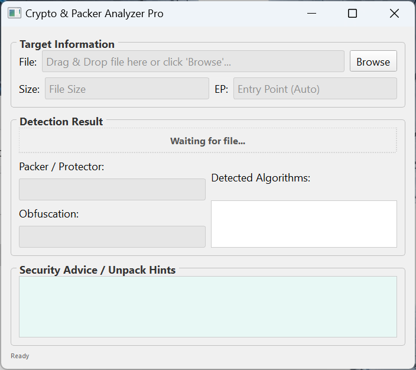
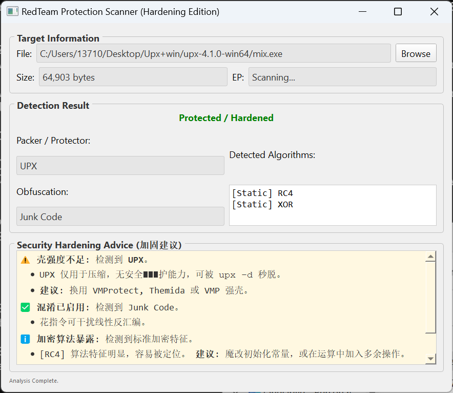

# CryptoScanner
自动化识别壳混淆加密工具
<div align="center">
   CryptoScanner 🛡️
  
  **An automated binary analysis framework designed to defeat modern obfuscation techniques.**
  
  [](LICENSE)
  [](https://www.python.org/)
  [](CONTRIBUTING.md)

  *Targeting: UPX + Junk Code + Runtime Encryption*
</div>

---

## 📖 Introduction

**CryptoScanner** is a next-generation reverse engineering tool built for security researchers and malware analysts. Unlike traditional unpackers, it combines static analysis with dynamic instrumentation to penetrate sophisticated obfuscation layers.

### ✨ Key Features

- **⚡ De-obfuscation Engine**: Automatically identifies and removes junk instructions (NOP sleds, dead code) using [Capstone](https://www.capstone-engine.org/) disassembly.
- **🕵️ Dynamic Tracing**: Hooks into runtime memory with [Frida](https://frida.re/) to capture decrypted payloads before they are executed.
- **📊 Visual Analysis**: Built-in PyQt5 GUI for real-time entropy visualization, helping you pinpoint packed sections instantly.
- **🛡️ Anti-Anti-Debug**: specialized logic to bypass common debugger detection techniques.

---

## 🚀 Quick Start

Get started in seconds.

### Prerequisites

- Python 3.8+
- Frida tools

### Installation

```bash
# Clone the repository
git clone https://github.com/JLEnoch1/CryptoScanner.git
cd CryptoScanner

# Install dependencies
pip install -r requirements.txt
```

### Usage

**Command Line Mode:**
```bash
python main.py --target ./samples/malware.exe --output ./unpacked/
```

**GUI Mode:**
```bash
python main.py --gui
```

---

## 📸 Screenshots

<div align="center">

  
  <p><i>Fig 1. Real-time entropy analysis of a packed executable showing decryption phases.</i></p>
    
</div>

---
## 🏗️ System Architecture

CryptoScanner follows a modular pipeline architecture designed for extensibility.

```mermaid
graph LR
    A[Input Binary] --> B(Static Analyzer)
    B --> C{Is Packed?}
    C -->|Yes| D[Dynamic Tracer (Frida)]
    C -->|No| E[Report Generator]
    D --> F[Memory Dump]
    F --> G[De-obfuscation Engine]
    G --> E
```

1.  **Static Analyzer**: Uses `pefile` to parse headers and calculate section entropy.
2.  **Dynamic Tracer**: Injects Frida scripts to hook decryption loops.
3.  **De-obfuscation Engine**: Cleans the dumped memory of junk instructions.

---

## 🤝 Contributing

We welcome contributions! Please see our [Contributing Guidelines](CONTRIBUTING.md) for more details.

## 📄 License

This project is licensed under the MIT License - see the [LICENSE](LICENSE) file for details.
